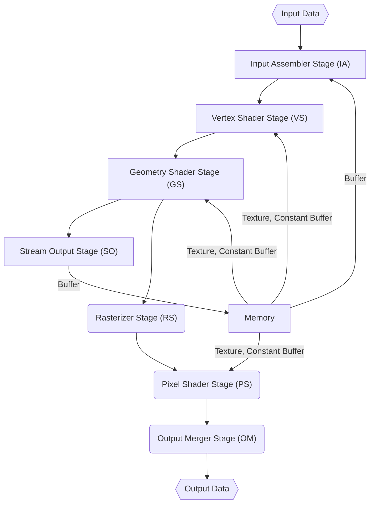

Robin Weiland

ECG important stuff
================

---

[TOC]

---

 

# Transformation classes

| transformation  |                                                             |
| :-------------- | :---------------------------------------------------------- |
| Rigid/Euclidean | preserve distances preserve angles                     |
| Similarity      | preserve angles                                             |
| Linear          | $L(p + q) = L(p) + L(q)$ $L(ap) = aL(p)$ $L(0)=0$ |
| Affine          | preserve parallel lines                                     |

# DirectX 10 class hardware pipeline

 

