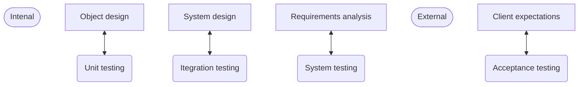

Robin Weiland

EIST Important Stuff
==================

[TOC]

# UML/Models

# System Design

Main influence of requirements analysis artifacts to system design

| Requirements analysis      | System Design                                                |
| -------------------------- | ------------------------------------------------------------ |
| Nonfunctional Requirements | 1. Design Goals                                              |
| Functional model           | 2. Subsystem decomposition 8. Boundary Conditions       |
| Object model               | 4. Hardware/software mapping 5. Persistent data management |
| Dynamic model              | 3. Concurrency 6. Global resource handling 7. Software control |

# Clues for design Patterns

| Pattern                | Text                                                         |
| :--------------------- | ------------------------------------------------------------ |
| Composite Pattern      | _complex structure_ _must have variable depth and width_ |
| Strategy Pattern       | _must provide a policy independent from the mechanism_ _must allow to change algorithms at runtime_ |
| Proxy Pattern          | _must be location transparent_                               |
| Observer Pattern (MVC) | _states must synchronized_ _many systems must be notified_ |
| Adapter Pattern        | _must interface with an existing object_                     |
| Bridge Pattern         | _must interface to several systems, some of them to be developed in the future_ _an early prototype must be demonstrated_ _must provide backward compatibility_ |
| Façade Pattern         | _must interface to existing set if objects_ _must interface to existing API_ _must interface to existing service_ |

# Examples for design patterns

## Adapter pattern

>   A game (-engine) could be - in theory - be designed in a way that it would be possible
>
>   to swap out the rendering pipeline between Input Assembler and Output Merger.
>
>   Although, this is a really unlikely and abysmally performing system, it shows that
>
>   in practice the adapter might be more than just passing through method calls.
>
>   In reality it will probably perform tasks like swapping data structures.
>
>   **Advantages**
>
>   -   easier to use for customers that will use the code for their own system
>   -   reusability for newer systems
>   -   ==TODO==
>
>   **Disadvantages**
>
>   -   Slowing down performance by processing data
>   -   encourages working around an old system than renewing it

## Bridge Pattern

>   a
>
>   **Advantages**
>
>   -   a
>
>   **Disadvantages**
>
>   -   a

## Composite Pattern

>   a
>
>   **Advantages**
>
>   -   a
>
>   **Disadvantages**
>
>   -   a

## Bridge Pattern

>   a
>
>   **Advantages**
>
>   -   a
>
>   **Disadvantages**
>
>   -   a

## Bridge Pattern

>   a
>
>   **Advantages**
>
>   -   a
>
>   **Disadvantages**
>
>   -   a

## Bridge Pattern

>   a
>
>   **Advantages**
>
>   -   a
>
>   **Disadvantages**
>
>   -   a

## Bridge Pattern

>   a
>
>   **Advantages**
>
>   -   a
>
>   **Disadvantages**
>
>   -   a

## Bridge Pattern

>   a
>
>   **Advantages**
>
>   -   a
>
>   **Disadvantages**
>
>   -   a

## Bridge Pattern

>   a
>
>   **Advantages**
>
>   -   a
>
>   **Disadvantages**
>
>   -   a

# 3 ways to use UML models

-   **Communication** common vocabulary  for informal communication $\rightarrow$ Target: human (developer, end user)
-   **Analysis and design** enable developers to specify a future system $\rightarrow$ Target: CASE tool, compiler
-   **Archival** provide a way for storing the design and rationale of an existing system $\rightarrow$ Target: human (analyst, project manager)

# Typical software development activities

|                                                              |                                                              |                    |
| :----------------------------------------------------------- | :----------------------------------------------------------- | ------------------ |
| Requirements elicitation  Analysis                 | What is the problem?                                         | Application domain |
| System design  Object design  Implementation  Testing | What is the solution?  What are the best data structures and algorithms for the solution? How is the solution constructed?  Is the problem solved? | Solution domain    |
| Delivery  Maintenance                              | Can the customer use the solution?  Are enhancements needed? | Application domain |

# Testing

## JUnit

Annotations

-   `@Test`
-   `@Test(expected=IllegalArgumentException.class)`
-   `@Test(timeout=100)`  (in ms)
-   `@Before`
-   `@After`
-   `@BeforeClass` (static method)
-   `@AfterClass` (static method)
-   `@Ignore(String)` ignore Test, print out string instead

## Integration Testing approaches in layered architecture

-   Big bang approach  (not good, for example for waterfall model)

    >   Test all Classes in Unit Tests separately before running one test for their entire integration

-   Stubs and drivers

    -   stub

        >   a component that is below the current implementation  [top down integration]

    -   driver

        >   a component that is above the current implementation  [bottom up integration]

-   Bottom-Up Integration

    -   no stubs
    -   useful for
        -   oo-systems
        -   performance oriented systems (real-time)
    -   drivers NEEDED
    -   User Interface implemented last

-   Top Down integration

    -   test cases can be defined related to the functional requirements
    -   no drivers
    -   stubs NEEDED, writing difficult, large number might be needed
    -   Interfaces may not be tested separately

-   Modified Top Down integration

    -   Test each layer separately
    -   NEEDS both stubs and drivers

-   Horizontal Integration (bath above are such integrations)

    -   difficult with larger systems

-   Vertical Integration

    -   Scenario driven design
    -   Used in scrum

## Blackbox and Whitebox testing

### Blackbox testing

>   In and output behavior of the system
>
>   testing partitions : test -1, 0, 1 instead of all numbers

### Whitebox testing

>   Coverage
>
>   Is all code run during a test to validate its quality 

