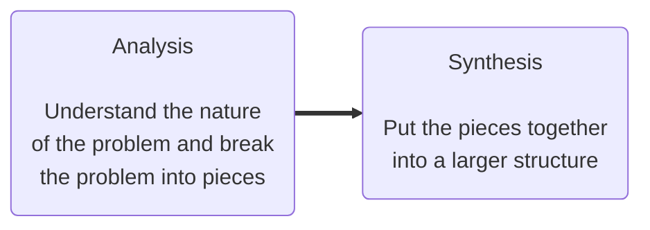
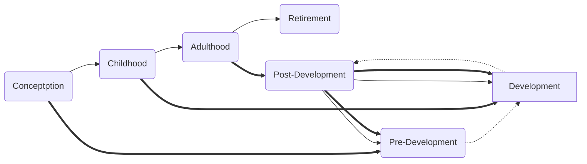

Robin Weiland

EIST Summary
==================

[TOC]

# 01 Introduction

---

## Abstraction

>   *The 7 ± 2 phenomena*
>   Our short term memory cannot store more than 7 ± 2 pieces at the same time
>   $\rightarrow$ chunking: Group collection of objects to reduce complexity

- thought process $\longrightarrow$ **activity**
- result $\longrightarrow$ **entity**

> Abstraction as a model of a *priorly*, *currently* or *not yet existing system*.

## Typical Models

|                      |                |                                          |
| :------------------- | :------------- | ---------------------------------------- |
| **Object** Model     | **entities**   | **structure** of the system?             |
| **Functional** Model | **use cases**  | **functions** of the system?             |
| **Dynamic** Model    | **activities** | system's **reaction to external events** |

> System model: object model + functional model + dynamic model

## Difficulties in software development

- Problem's **ambiguity**                      [impossible trident](https://en.wikipedia.org/wiki/Impossible_trident)
- **Requirements** are usually **unclear** and **change** when they become clearer
- The **problem domain** (also **application domain**) is **complex**, and so is the **solution domain**
- The **development process** is **difficult to manage**
- Software is a **discrete** system
    -   Continuous systems have no hidden surprises
    -   Discrete systems can have hidden surprises! ([Parnas](https://en.wikipedia.org/wiki/David_Parnas))

## Software Engineering as a problem solving activity

## Techniques, methodologies and tools

|                          Techniques                          |                        methodologies                         |                            tools                             |
| :----------------------------------------------------------: | :----------------------------------------------------------: | :----------------------------------------------------------: |
| **Formal procedures** for producing results using some **well defined notation** | **Collection of techniques** applied across software development and unified by a philosophical approach | **Instruments or automated systems** to accomplish a technique |
|                 recipe, quick sort algorithm                 | cookbook, object oriented analysis and design, functional decomposition |            compiler, editor, debugger, IDE, CASE             |

## [Team]

I don't know whether that's important for the exam, but it feels like some bs they could ask in a bad mood.

### Stages of team development

### Team productivity and performance

### Difference between group and team

-   ==Group== a number of people that have some relationship to one another
    -   Participants are loosely connected
    -   Do not focus on specific outcomes or a common purpose
    -   Every individual works on his own
-   ==Team== any group of people involved in the same activity with a common goal, especially referring to sports and work
    -   Participants are strongly connected
    -   Focus on a specific outcome, requires coordination of tasks and activities
    -   Members need to work together

## Phenomenon vs. Concept

Phenomenon
​		An **object** in the **world of a domain** as it is **perceived**
​		*This EIST lecture at 9:25		 my black watch*

Concept
		**Common properties** of phenomena
		*All lectures on software engineering		All black watches*

|         | A concept is a 3-tuple                                       |
| :------ | :----------------------------------------------------------- |
| Name    | The name distinguishes the concept from other concepts       |
| Purpose | Properties that determine if a phenomenon is a member of a concept |
| Members | Set of phenomena which are part of the concept               |

> [**Abstraction:**](## Abstraction) classification of phenomena into concepts 
>
> **Modelling:** development of abstractions to answer specific questions about a set of phenomena while ignoring irrelevant details

## Systems, models and views

### Systems

- Organized set of communicating parts
    - Natural system: a system whose ultimate purpose is not known
    - Engineered system: designed and built by engineers for a specific purpose

- The parts of the system can be considered as systems again
    - In this case we call them subsystems

|    natural systems     |  engineered systems  |           subsystems           |
| :--------------------: | :------------------: | :----------------------------: |
| universe, earth, ocean | airplane, watch, GPS | jet engine, battery, satellite |

### Model and View

-   Model: Abstraction of a system
-   View: Selected aspects of a model
-   Notation: Set of Graphical or textual rules for depicting models and views
    -   Informal ("napkin design")
    -   Formal (UML)

|  System  |               Model               |                             View                             |
| :------: | :-------------------------------: | :----------------------------------------------------------: |
| Airplane | Flight simulator Scale model | Blueprint of the airplane electric wiring diagram an airplane breaking the sound barrier |

### Napkin Notation 

### UML Notation

## Overview of UML diagrams

## OOP principles (some with maybe not so obvious terminology)

### Type & instance

|  name   |     purpose     |            members            |
| :-----: | :-------------: | :---------------------------: |
|   int   | integral number | $\N_{\text{in memory range}}$ |
| boolean |     logical     |         {true, false}         |

These relationships are similar

-   Type $\longleftrightarrow$ variable
-   Concept $\longleftrightarrow$ Phenomenon
-   Class $\longleftrightarrow$ Object

### Encapsulation

>   Encapsulation means creating classes for such objects to define
>   -   Structure / state by using attributes
>   -   Functionality / behavior by providing methods
>   
>   

 

# 02 Model based Software Engineering

---

## Software Lifecycle

-   Set of activities and their relationships to each other to support the development if a software system
-   Examples of activities: requirements elicitation, analysis, system design, implementation, testing, configuration management, delivery
-   **Software lifecycle model** An abstraction representing the development of software for the purpose of understanding, monitoring or controlling the development of software

|                       |                                                         |
| :-------------------- | :------------------------------------------------------ |
| Requirements analysis | What is the problem?                                    |
| System design         | What is the solution?                                   |
| Object design         | What are the best mechanisms to implement the solution? |
| Implementation        | How is the solution constructed?                        |
| Testing               | How is the problem solved?                              |
| Delivery              | Can the customer use the solution?                      |
| Maintenance           | Are enhancements needed?                                |

A **lifecycle** is based (loosely) on the metaphor of the life of a person

## Tailoring

>   There is no “one size fits all” software lifecycle model that works for all possible software engineering projects

| Tailoring | adjusting a lifecycle model to fit a project    |
| :-------- | :---------------------------------------------- |
| naming    | adjusting the naming of activities              |
| cutting   | removing activities not needed in the project   |
| ordering  | defining the order the activities take place in |

## Controlling software development with a process

|            organizational maturity (Humphrey '89)            |                    agility (Schwaber '01)                    |
| :----------------------------------------------------------: | :----------------------------------------------------------: |
| Repeatable process Capability Maturity Model Integration (CMMI) | Large parts of the _sd_ is empirical in nature they cannot be modelled with a defined process |

## Defined vs Empirical process

|                     Defined process                     |              Empirical process              |
| :-----------------------------------------------------: | :-----------------------------------------: |
| Planed Follows strict rules Avoids deviations | Not entirely planned inspect and adapt |

# 03 Requirements Analysis

---

# 04 System Design I

---

# 05 System Design II

---

# 06 Object Design I

---

# 07 Object Design II

---

# 08 Testing

---

# 10 Software Configuration Management

---

# 11.1 Software Quality Management

---

# 11.2 Guest Lecture: Dr. Elmar Jürgens

---

# 12 Project Management

---

